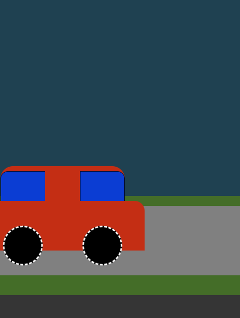

# Car-animation

## General Information
A simple and my first CSS animation showing a moving car at sunrise and sunset. 

## Technologies
Project is created with:
* HTML
* CSS with SASS

## Features
- the lowering of the sun with the simultaneous formation of night - darkening of the background,
- rotating wheels in the car, 
- intense colors.

## What to improve:
- adding animation for the background,
- ensuring responsiveness,
- adding gradients.

## Acknowledgements
The design of the website was created while learning the "WEB DEVELOPMENT COURSE" from MMC School (https://mmcschool.pl/kursy/kurs-tworzenia-stron-www-cz-2.html).

## Contact
Feel free to contact me:
  
Email: aleksandrawypych.p@gmail.com  
Portfolio: https://www.behance.net/aleksanwypych-p
